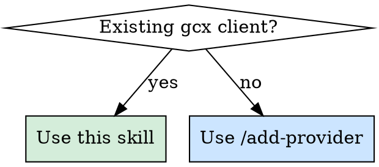
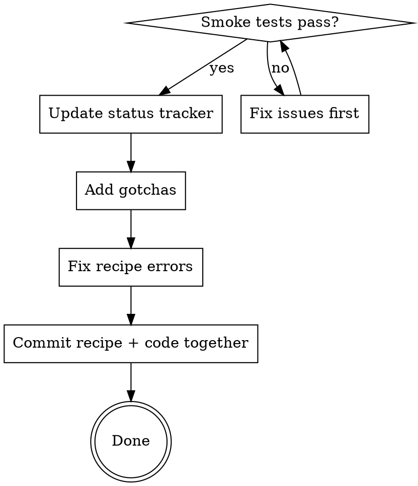

# Migrate Provider from gcx

Port an existing gcx resource client into a grafanactl provider using the
`TypedResourceAdapter[T]` pattern.

## When to Use



- Porting a gcx resource to grafanactl as part of the consolidation
- User says "migrate provider", "port from gcx", "port {product}"
- A bead task references gcx provider migration

## Evergreen Recipe

The migration recipe is a living document that accumulates lessons from each
port. **You MUST read it before starting and update it after finishing.**

```
docs/migration/gcx-provider-recipe.md
```

The recipe is the source of truth for mechanical porting steps. This skill
wraps it with workflow discipline.

## Workflow

### Phase 1: Pre-flight

1. **Read the recipe**: `docs/migration/gcx-provider-recipe.md` — front to back
2. **Run the pre-flight checklist** from the recipe — answer all 6 questions
3. **Locate gcx source files** — find the grafana-cloud-cli repo in the
   workspace or ask the user for its path:
   - Client: `pkg/grafana/{resource}/client.go`
   - Commands: `cmd/` (check resources/, observability/, oncall/, platform/)
   - Types: usually in client.go or a separate types.go
4. **Check K8s discovery**: `grafanactl --context=ops resources schemas | grep -i {resource}`
   - If already discovered → no provider needed, skip this migration

### Phase 2: Implement

Follow steps 1-6 in `docs/migration/gcx-provider-recipe.md`.

Key decisions per resource:
- **Provider grouping** — new provider or add to existing? (e.g., `grafana`, `iam`, `oncall`)
- **Auth model** — same token or separate? (check gcx's client constructor)
- **ID scheme** — string UID, int ID, or composite?

For complex providers (OnCall, K6, Fleet) with multiple sub-resources:
- Create one provider package with subpackages per resource type
- Port the simplest sub-resource first as a validation
- Wire remaining sub-resources incrementally

### Phase 3: Verify

```bash
make all                                         # lint + tests + build + docs
grafanactl providers                             # new provider listed
grafanactl resources get {alias}                 # returns data
grafanactl resources get {alias}/{id} -o json    # single resource in JSON
```

For complex providers, also verify:
- Each sub-resource type is accessible via `grafanactl resources get`
- Push/pull round-trips work (pull → edit → push → pull → compare)
- Provider-specific commands work (if any)

### Phase 4: Update Recipe (MANDATORY)

**Do NOT skip this step.** The recipe is only as good as the lessons captured.



1. **Update the status tracker** — mark provider ✅ done with date
2. **Add gotchas** — auth quirks, unexpected API shapes, pagination edges,
   cross-reference patterns, anything surprising or slow
3. **Fix recipe errors** — if any step was wrong or misleading, correct it
4. **Commit together** — recipe update in the same commit as provider code

## Red Flags — STOP and Check Recipe

If you catch yourself doing any of these, stop and re-read the recipe:

| Thought | Problem |
|---------|---------|
| "I'll just copy the gcx client as-is" | grafanactl uses different HTTP patterns — adapt, don't copy |
| "I'll skip the pre-flight, it's obvious" | K8s discovery may already cover this resource |
| "I'll update the recipe later" | You won't. Update it NOW while friction is fresh |
| "This resource is too different for the pattern" | It's not — OnCall's 12 sub-resources fit. Ask for help if stuck |
| "I don't need tests, I verified manually" | httptest + round-trip tests are mandatory. `make all` enforces this |

## Reference Implementations

| Provider | Complexity | Auth Model | Good Example For |
|----------|-----------|------------|-----------------|
| synth | Medium | Separate URL + token | External API, cross-references |
| slo | Medium | Same Grafana token | Plugin API, status/timeline commands |
| alert | Simple | Same Grafana token | Read-only provider |

## Tips for Complex Providers

**OnCall** (12 sub-resources):
- Start with `integrations` — simplest, validates the pattern
- OnCall API URL discovered via GCOM, not configured directly
- Iterator-based pagination — port the pattern, don't simplify

**K6** (multi-tenant auth):
- Two auth modes: org-level and stack-level
- Separate API domain (not Grafana stack URL)
- Check gcx's `k6/client_envvar_test.go` for auth resolution logic

**Fleet/Alloy** (4 sub-resource types):
- All share same base URL and auth
- Single provider, four subpackages

## Checklist

```
[ ] Pre-flight questions answered (recipe section)
[ ] K8s discovery checked (skip if already there)
[ ] Recipe read front-to-back
[ ] types.go ported (json tags preserved exactly)
[ ] client.go ported (adapted to grafanactl HTTP pattern)
[ ] adapter.go wired via TypedRegistration[T]
[ ] init() registration + blank import added
[ ] Tests written (client httptest + adapter round-trip)
[ ] make all passes
[ ] grafanactl resources get {alias} returns data
[ ] Recipe updated with status + gotchas
[ ] Changes committed (recipe + code together)
```
