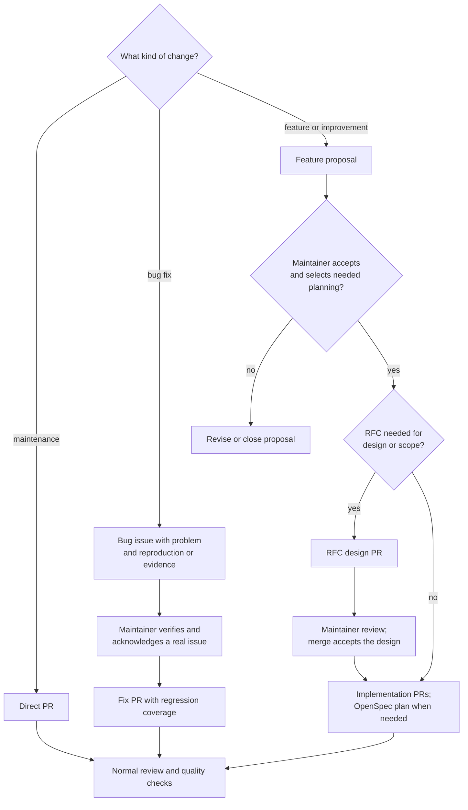

# Contributing Guidelines

This document is a guide to help you through the process of contributing to `gcx`.

Before implementing features or commands, read:

- [ARCHITECTURE.md](ARCHITECTURE.md) — system architecture, pipeline diagrams, ADR index
- [DESIGN.md](DESIGN.md) — CLI UX design: command grammar, output model, taste rules
- [CONSTITUTION.md](CONSTITUTION.md) — invariants you must not violate
- [docs/design/](docs/design/) — prescriptive UX implementation rules (output, errors, agent mode, naming, …)

Naming a command? Start with the [command naming and placement guide](docs/design/command-naming.md).

For agent-assisted contributions, start with the repository-local [`contribute`](.claude/skills/contribute/SKILL.md) skill. It routes the work through the workflow below and loads placement, command-contract, and implementation guidance when needed.

## Contribution workflow

Choose the route by the purpose of the change:

- **Maintenance:** documentation, test-only changes, and internal maintenance that preserve public behavior can go directly to a PR. An issue is optional.
- **Bug fix:** open or use a bug issue with a clear problem and reproduction or supporting evidence. A maintainer verifies and acknowledges that it is a real issue before the fix PR. The usual deliverable is the issue plus a PR, appropriate regression coverage, and the normal checks; an RFC or OpenSpec change is not required by default.
- **Feature:** new capabilities, improvements to existing capabilities, and proposed commands use a [Feature proposal](.github/ISSUE_TEMPLATE/2-feature-proposal.yml), whether the contributor plans to implement them or is requesting them. A maintainer accepts the proposal and identifies any planning needed before implementation.



For a **bug**, acknowledgement depends on the report's quality and the evidence available. It does not promise a deadline or approve a detailed fix design. If resolving the bug needs agreement on design or changed public behavior, continue that discussion on the same issue and use the planning it warrants. Implementation size alone does not trigger extra artifacts.

For a **feature**:

1. **Proposal.** State the **Problem**, illustrate the **Proposed UX**, and give checkable **Acceptance criteria**. Examples should scale to the proposal; add scope, open questions, and implementation notes where useful. State unresolved feasibility explicitly. The [`propose-feature`](.claude/skills/propose-feature/SKILL.md) skill helps prepare the proposal.
2. **Decision and planning.** Wait for maintainer acceptance on the issue. The accepting maintainer identifies whether the work needs a separate design or tracked implementation plan. Reuse decisions already settled in the proposal rather than duplicating them.
3. **RFC, when warranted.** Write the design in [`docs/rfcs/`](docs/rfcs/README.md) using [`create-rfc`](.claude/skills/create-rfc/SKILL.md), and open a design PR referencing the proposal (`Related: #<issue>`). Merging that PR accepts the design. An RFC is useful when design tradeoffs or scope need agreement, including an overarching design for several PRs; splitting straightforward work across PRs does not itself require one. Most PRs do not need an RFC.
4. **Implementation.** Open reviewable PRs that reference the accepted proposal and any RFC. Use [OpenSpec](openspec/) when a tracked implementation plan is needed; each OpenSpec change belongs to one PR. Straightforward slices can be tracked on the issue. Maintainers review each PR, and contributors revise until it merges.
5. **Close.** Intermediate PRs reference the proposal without closing it. The final PR that completes its acceptance criteria closes it (`Closes #<issue>`).

Grafana product teams are encouraged to follow this process inside their existing owned product area, but it is not mandatory there. Normal review and quality requirements still apply. Changes to shared commands, work outside an owned area, and new top-level areas follow the proposal route; see [Product teams](#product-teams) for ownership.

Command paths, flags, and positional syntax are stable within a major version ([CONSTITUTION.md](CONSTITUTION.md#cli-grammar)). Placement and naming are therefore hardest to change after review and release. Discussing a proposal first lets maintainers resolve those choices before reviewing a finished implementation. This includes changes to existing command paths, flags, positional arguments, or output shape that introduce new behavior.

If you have already written a proposed feature, open or link the proposal so maintainers can review the idea before the diff. Existing issues and PRs need not be re-filed or gain retrospective planning artifacts because of this workflow update.

## Stable, experimental, or not gcx

Not every good idea has to ship as a stable command on day one.

| Outcome          | How it ships                                                                        | The bar                                                                                                               |
| ---------------- | ----------------------------------------------------------------------------------- | --------------------------------------------------------------------------------------------------------------------- |
| **Stable**       | A normal command                                                                    | Backed by a GA API whose shape, auth and limits are settled; name you're happy to support for the whole major version |
| **Experimental** | `[experimental]` in the short description, `agent.StabilityExperimental` annotation | Real use case, but the API or the command shape may still change                                                      |
| **Not gcx**      | —                                                                                   | The backend isn't ready, or the capability belongs to the product's own API or UI                                     |

Experimental is not a consolation prize: it is exempt from the compatibility promise, so it is the right place for anything backed by a non-GA product feature or whose shape you aren't yet sure of. See [experimental-commands.md](docs/design/experimental-commands.md) for how to mark one. If you're unsure, **propose it as experimental yourself** — it is much easier to say yes to.

"Not gcx" usually means a backend prerequisite: gcx wraps product APIs, it does not fix them. Missing pagination, unstable payloads or unclear RBAC need to be solved by the owning team first. In the meantime, [`gcx api`](docs/reference/cli/gcx_api.md) gives raw access to any Grafana API.

## Prefer extending a command over adding one

Before adding a command, check whether an existing one can answer the same question with one more flag, or whether the operation is already covered by the standard verbs — `list`, `get`, `create`, `update`, `upsert`, `push`, `pull`, `delete`, `query`, `search`. [Prefer existing command operations](docs/design/command-naming.md) over inventing new ones; `cmd/gcx/root/commandoperations_test.go` enforces this.

If two open PRs would add overlapping commands, we'd rather consolidate them before merging than ship both and deprecate one in the next major release. Searching [open pull requests](https://github.com/grafana/gcx/pulls) for your area before you start is worth the two minutes.

## A note on AI-assisted contributions

These are welcome — this repository ships contributor skills precisely because most changes here are written with an agent's help. Two requests:

1. **Read and understand the diff before you send it.** We will ask about
   design decisions, and "the agent chose that" is a difficult place to review
   from.
2. **Placement is the part an agent is least likely to get right.** An agent
   asked to add a command will add a command. Whether it should exist, and
   what it should be called forever, is a judgement about gcx's users — which
   is why we ask for the issue first. The `contribute` skill helps, but
   doesn't replace that conversation.

A PR that is easy to generate can still be expensive to review. The issue step is how we keep that cost from landing on you as a rejection.

## Conventions we enforce

Run `mise run gate` (lint + tests + build) before pushing, and `GCX_AGENT_MODE=false mise run reference` if you touched commands, flags, config or env vars. The specifics:

- **Signed commits are required.** Every commit must have a verified signature — this is [a Grafana organisation-wide policy](https://community.grafana.com/t/action-required-signed-commits-mandatory-for-all-grafana-repositories/163404). Set it up once; it is the most common reason a finished PR sits unmerged.
- **Generated reference docs must not drift.** The `Documentation` check runs `mise run reference-drift`; regenerate with the command above.
- **Every `gcx` invocation in a skill must exist.** `TestSkillsGcxInvocationsMatchCommandTree` checks `claude-plugin/skills/` and `.claude/skills/` against the real command tree.
- **Experimental commands must be marked consistently** — `cmd/gcx/root/experimental_test.go`.
- **A code owner must approve.** See [Code ownership](#code-ownership) below.

The checks that must pass to merge are `Tests`, `Linters` and `Documentation`, plus the organisation's signed-commit and secret-scanning checks.

Not enforced automatically, but please follow it: **conventional commit PR titles** — `feat(slo):`, `fix(traces):`, `docs:` and so on. PRs are squash-merged, so the title becomes the commit message and feeds the changelog. Mark breaking changes with `!`.

## What you can expect from us

- **An automated review.** A Claude code review runs when a non-draft PR is opened or marked ready for review, checking against the docs linked above. Treat it as a first pass; a human still reviews.
- **CI on forks may need approval.** Workflow runs on pull requests from forks can require a maintainer to approve them. If your checks show as pending, they're waiting on us, not you — feel free to comment if it's been a while.
- **We'll tell you the outcome.** If we ask for a command to be experimental, renamed, or folded into an existing one, that's a yes with a placement, not a rejection.
- **If we're going to say no, we'll try to say it on the issue, not on your PR.** That's the whole point of proposing first.

## Code ownership

The code in this repository is owned by multiple teams. The ownership is codified in the [CODEOWNERS](./.github/CODEOWNERS) file. The @grafana/grafana-gcx team is responsible for the overall architecture of the repository, along with any features or functionality that are not specific to any particular provider.

### Product teams

Grafana engineering teams are welcome to contribute to and maintain their areas of the codebase without any interaction from the @grafana/grafana-gcx team. The [CODEOWNERS](./.github/CODEOWNERS) file should be such that these teams only need approvals from their own team to merge pull requests in their product area. If you find this is not the case, please do reach out to the @grafana/grafana-gcx team, or raise a pull request with a [CODEOWNERS](./.github/CODEOWNERS) change. If you are unsure, please reach out in the #gcx channel and we'd be happy to discuss.

We have tools in place to help maintain a consistent command surface and output conventions across the codebase, as well as LLM-assisted code review to try and ensure that the architecture and design conventions are followed. For more details on these tools, see:

- [The claude code review GH action, with prompt & references](.github/workflows/claude-code-review.yml). This should encourage authors to adhere to the guidelines linked above.
- [Prefer existing command operations over creating new ones](docs/design/command-naming.md) (test files are [here](cmd/gcx/root/commandoperations_test.go))
- [Syntax for experimental commands](docs/design/experimental-commands.md) (test files are referenced from the docs)

## Issue Tracking

Issues are tracked in [GitHub Issues](https://github.com/grafana/gcx/issues). Use the Bug report or Feature proposal form when creating a new issue. The forms select the Bug or Feature issue type and the triage label; other organization-wide issue types remain available. The issue chooser also links to documentation and private security reporting.

## Making changes

### Agentic coding

Use [`contribute`](.claude/skills/contribute/SKILL.md) as the contributor entrypoint. It applies the [contribution workflow](#contribution-workflow), checks capability placement and contracts, and loads provider or datasource implementation references as needed.

The [`propose-feature`](.claude/skills/propose-feature/SKILL.md), [RFC](docs/rfcs/README.md), and `openspec-*` skills remain available directly for their specialist tasks. Use them when the selected route needs their artifact; they reuse the existing issue and design decisions.

### Development environment

`gcx` relies on [`mise`](https://mise.jdx.dev/) for tooling, and [Docker](https://docs.docker.com/get-started/get-docker/) for local development dependencies.

Install mise and set up the project. For macOS:

```console
$ brew install mise        # or: curl https://mise.run | sh
$ mise trust               # trust the mise.toml configuration
$ mise install             # install tools (Go, golangci-lint, etc.)
$ mise run deps            # install Go modules and Python requirements, including MkDocs
```

Run `mise run deps` before `mise run docs` or `mise run all`.

Some mise commands for local development:

```console
$ mise run build           # build to bin/gcx
$ mise run lint            # run golangci-lint
$ mise run tests           # run all tests
$ mise run all             # lint + tests + build + docs
$ mise tasks               # list all available tasks
```

### Testing against a real Grafana API

While unit tests are valuable for testing individual components, integration testing against a real Grafana instance is important to ensure `gcx` works correctly with the actual Grafana API.

### Quick Start

The repository includes a `docker-compose.yml` file that sets up a complete test environment with:

- Grafana
- MySQL for storage
- Pre-configured with `admin:admin` credentials
- The `kubernetesDashboards` feature toggle enabled (required for `gcx`)

Run this with:

```console
$ mise run test-env-up
```

Check the status of the services with:

```console
$ mise run test-env-status
```

You can use the provided config file to get gcx to use the local Grafana instance. For example:

```console
$ go run ./cmd/gcx --config testdata/integration-test-config.yaml resources list-types
```

### Stopping the test environment

When you're done testing, stop the services:

```console
$ mise run test-env-down
```

To remove all data (including database volumes):

```console
$ mise run test-env-clean
```

### Customizing the test environment

#### Modifying Grafana configuration

The Grafana instance uses a custom configuration file at `testdata/grafana.ini`. You can modify this file (you will need to restart the service)

```console
$ docker-compose restart grafana
```

#### Using a different Grafana version

To test against a different Grafana version, modify the `image` field in `docker-compose.yml`:

```yaml
services:
  grafana:
    image: grafana/grafana:12.1 # or any other version
```

Then restart the service:

```console
$ docker-compose up -d --force-recreate grafana
```

### View local grafana logs

To view logs from all services:

```console
$ mise run test-env-logs
```

To view logs from a specific service:

```console
$ docker-compose logs -f grafana
```

## Releasing gcx

### Generating a changelog and tagging

Releases are automated via `mise run tag`. It requires the `claude` CLI and [`svu`](https://github.com/caarlos0/svu).

```console
$ mise run tag -- patch   # or minor, major
```

This generates a changelog entry (via Claude), updates `CHANGELOG.md` and `.release-notes.md`, commits, tags, and pushes. The tag push triggers GoReleaser.

**With branch protection** (can't push directly to main): the script will fail at the push step. Instead:

1. Create a branch, commit the changelog, open a PR
2. Merge the PR
3. Tag the merge commit on main and push the tag:
   ```bash
   git checkout main && git pull
   git tag v0.X.Y
   git push origin v0.X.Y
   ```

### GoReleaser

Triggered automatically by the tag push via `.github/workflows/release.yaml`. GoReleaser builds binaries for all platforms and creates the GitHub release. No manual steps required. GoReleaser has no Homebrew role — the formula is rendered by a separate workflow (see below).

### Homebrew tap integration

After each stable release, `.github/workflows/publish-homebrew-formula.yml` runs automatically and opens a pull request against `grafana/homebrew-grafana` to add or update `gcx.rb` at the tap root (flat layout, alongside `alloy.rb`). The workflow:

1. Checks out gcx at the release tag.
2. Computes the SHA-256 of the GitHub-generated source tarball (`archive/refs/tags/vX.Y.Z.tar.gz`).
3. Renders `.github/homebrew/gcx.rb.tmpl` via `envsubst`, substituting `${VERSION}` and `${SHA256}`.
4. Clones the tap, commits the rendered `gcx.rb`, and opens a PR from a branch named `gcx-<version>`.

**The formula is not generated by GoReleaser.** If you're updating formula content, edit `.github/homebrew/gcx.rb.tmpl` directly — not `.goreleaser.yaml`. Pre-release tags (`v*-rc.*`, `v*-dev.*`) are skipped; the publish workflow exits cleanly for them.

If the workflow fails with a `401` or `permission denied` from `gh pr create` or `git push`, the App credentials used to authenticate against the tap have lapsed — check the Actions tab for the failing run and verify the secrets in the internal release runbook.

You can re-run the publisher for a past tag via the workflow's `workflow_dispatch` trigger (Actions tab → "Publish Homebrew Formula" → Run workflow → enter the tag).
