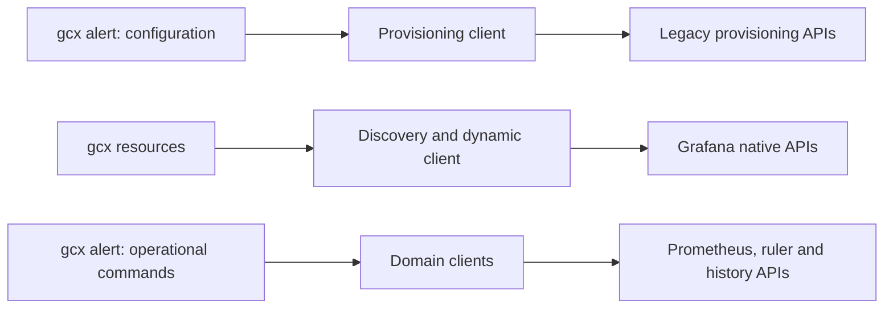
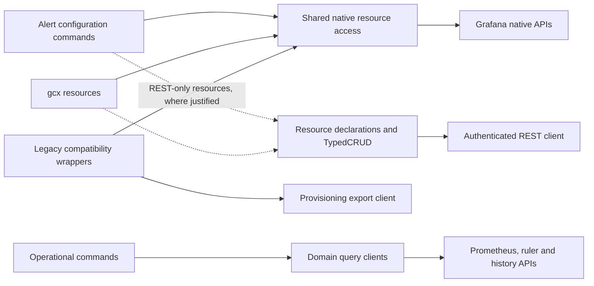

# RFC: Unify alerting configuration and resource workflows

**Status:** Proposed · **Date:** 2026-09-23 · **Scope:** GCX alerting

## Summary

We propose refactoring the existing alerting provider so dedicated commands and
`gcx resources` share configuration access and mutation behavior. Grafana-native
resources would use discovery and the dynamic client; suitable REST-only resources
would use the declarative provider adapter framework. Operational queries would
retain their domain APIs. Delivery would proceed incrementally, preserving
released command contracts.

## Motivation and current architecture

Alerting configuration currently has two access paths. Dedicated notification
commands use legacy provisioning APIs, while generic resource commands use
Grafana's native APIs. This produces inconsistent coverage: notification-policy
export addresses the singleton endpoint and omits named trees. Provider commands
also cover evaluation state, history, and datasource ruler operations, which have
different semantics from configuration CRUD.



The goal is consistent resource management, including named notification trees,
without changing how existing scripts interpret command output or exports.
Backend API redesign, command generation, and replacement of Cloud evaluation or
delivery services are out of scope.

## Proposed architecture

Retain one registered alerting provider. Separate configuration access, operational
queries, and legacy compatibility wrappers. Dedicated commands own CLI behavior
and rendering; shared resource access owns identity, transport, and CRUD semantics.



| Surface | Proposed integration |
|---|---|
| Policies, receivers, templates, intervals, inhibition rules | Native `notifications.alerting.grafana.app/v1beta1`; routing trees first |
| Grafana rule definitions | Native `rules.alerting.grafana.app/v0alpha1`; validate rule and sequence semantics separately |
| Suitable REST-only configuration | `adapter.Resource[T]` and shared `TypedCRUD`; use the explicit shared builder when capability inference does not fit |
| Health, instances, history, datasource ruler workflows | Dedicated domain clients; assess declarative ruler support separately |

Native resources retain their server-defined group, version, kind, and schema.
They do not receive duplicate synthetic adapter registrations. For example, both
entry points would address routing trees through the same resource identity:

```go
// Illustrative native-client access; namespace comes from resolved configuration.
routingTrees := schema.GroupVersionResource{
    Group: "notifications.alerting.grafana.app",
    Version: "v1beta1", Resource: "routingtrees",
}
trees := dynamicClient.Resource(routingTrees).Namespace(namespace)
tree, err := trees.Get(ctx, name, metav1.GetOptions{})
// Handle err, edit the desired fields, and retain metadata.resourceVersion.
// trees.Update(ctx, tree, metav1.UpdateOptions{})
```

For REST-backed adapters, one resource declaration would supply both registration
and typed CRUD. Clients implement only supported capability interfaces; command
factories load dependencies lazily after validation and confirmation. The existing
framework provides this binding pattern:

```go
// Illustrative binding for an adapter-backed resource declaration.
bound := providers.BindGrafanaResource(loader, resource)
// Within command execution, after validation and confirmation:
crud, cfg, err := bound.Load(cmd.Context())
// Handle err; use crud for resource operations and cfg for auxiliary queries.
```

Use `adapter.NewProvider` where its composition contract fits, with fresh command
factories. A commands-only provider remains valid when all configuration resources
are native. Framework adoption must remove duplicated construction or behavior;
it should not introduce adapters solely for structural consistency.

**Decision requested:** extend the documented dashboards exception to permit
alerting commands over shared native resource access. Update the architecture
invariants explicitly. Additional framework changes should be justified by a
concrete resource requirement and reviewed separately from provider migrations.

## Compatibility and correctness

Released command paths, flags, defaults, outputs, and mutation receipts remain
stable. Provisioning exports remain distinct from native resource manifests.
Named-tree export would explicitly select the tree using the existing backend
contract; the no-selector behavior remains unchanged:

```http
GET /api/v1/provisioning/policies/export?format=yaml&routeName=team-a
```

Resource workflows must preserve identity, optimistic concurrency, provenance,
and permissions. Deleting the default tree resets it; deleting a named tree
removes it. Receiver reads redact secrets, so same-instance updates must retain
integration IDs and secret markers; portable restore requires supplied secrets.
Collection deletion, pagination, and server dry-run support must be verified
rather than inferred from API shape. Preview must not issue potentially mutating
requests. Permission-filtered results must not imply unrestricted inventory.

The September 22 Cloud configuration spans Grafana 13.2 slow through 13.3 instant
builds. Native APIs exist in the inspected slow and steady revisions. Validate
against the slow baseline and a newer channel, with discovery-based capability
checks for other installations. This proposal does not raise GCX's overall
Grafana 12+ support floor. Operational status queries remain necessary because
native remote-status synchronization is newer than the inspected slow baseline.

## Rollout and acceptance

1. Establish shared native access and named routing-tree lifecycle, retaining
   compatible provisioning export.
2. Migrate remaining notification resources in separate slices, validating
   secret retention and dependency ordering before supporting bulk restore.
3. Align rule-definition access and construction; preserve operational APIs and
   evaluate any REST-only resource candidates individually.
4. Remove replaced wiring and document supported operations and version limits.

Each slice must compare dedicated and generic commands, test permissions, stale
versions and nonmutating preview, and pass repository gates. The first live test
must edit one of two named trees without changing the other or default, then
verify rule assignment independently. Tests use disposable resources with cleanup.
Shared framework changes should land before dependent provider changes.

An export-only fix addresses the immediate symptom but leaves fragmented resource
access. A wholesale rewrite combines unrelated API and compatibility risks. We
recommend the staged approach to deliver consistent behavior in reviewable steps.

## References

- [Declarative provider architecture](../adrs/declarative-provider-registration/001-declarative-resource-front-door.md)
- [Provider implementation guide](../reference/provider-guide.md)
- [Grafana notification API registration, Cloud slow baseline](https://github.com/grafana/grafana/blob/90a1a3acbc43c5419f0d3d97eb84415e60cbe0b1/pkg/registry/apps/alerting/notifications/register.go)
- [Cloud slow-channel configuration, September 22 snapshot](https://github.com/grafana/deployment_tools/blob/193445004c5812433a3b3d581851144b0b9bc139/ksonnet/environments/hosted-grafana/waves/channels/prod/slow.libsonnet)
