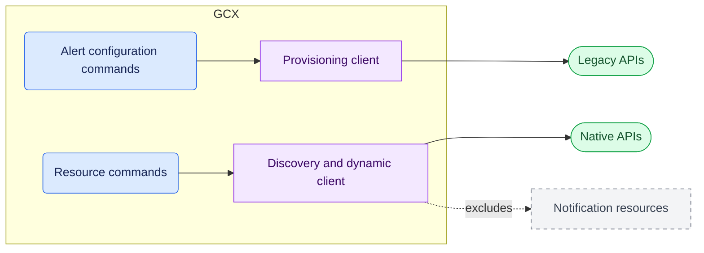
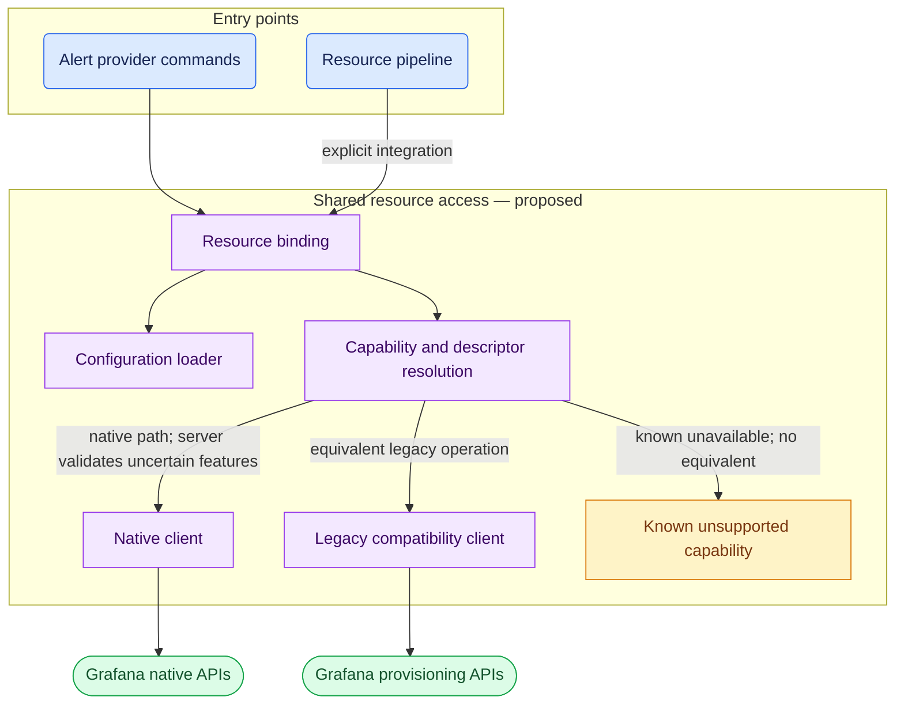

# RFC: Unify alerting configuration and resource workflows

**Status:** Proposed · **Scope:** GCX alerting

## Summary

We propose a shared resource-access binding for alerting configuration, used by both dedicated commands and `gcx resources`. This follows the dashboards model: users can choose imperative CRUD or declarative push without encountering different resource identities or manifest formats. Shared helpers would reduce client setup and compatibility code, while the existing declarative adapter framework would serve suitable REST-only resources.

The refactor would retain Grafana 12+ support through graceful degradation: use supported native operations, select equivalent legacy operations where available, and explain capabilities the target cannot provide. Operational commands for status, instances, history, and datasource-managed rules would continue using their current APIs.

## Motivation

Dedicated notification commands currently use provisioning APIs, while generic resource commands use native API discovery. The notification API group is [excluded from discovery](../../internal/resources/discovery/registry.go). Meanwhile, [`notification-policies export`](../../internal/providers/alert/notification_policies_commands.go) addresses only the default tree, even when named trees exist. These separate paths make coverage and behavior difficult to keep consistent.

## Scope

This proposal covers alerting configuration through dedicated CRUD and generic resource workflows, including cross-stack transfer and capability-aware Grafana 12+ support. Status, instances, history, and datasource-managed ruler workflows retain their current APIs. Backend API redesign, command generation, and changes to evaluation or notification delivery services are outside this work.

## User experience

### Manage a named routing tree

Today, policy commands operate on a singleton and use provisioning payloads:

```sh
# Current: read, replace, or export the default policy tree.
gcx alert notification-policies get -o yaml > policy.yaml
gcx alert notification-policies set -f policy.yaml
gcx alert notification-policies export --format yaml
```

On a target that supports named routing trees, the proposed commands address a named resource and exchange native manifests:

```sh
# Proposed: edit one named tree without replacing the default tree.
gcx alert routing-trees list
gcx alert routing-trees get team-a -o yaml > tree.yaml
# Edit tree.yaml, retaining metadata.resourceVersion.
gcx alert routing-trees update team-a -f tree.yaml

# Proposed: create and delete use the same resource model.
gcx alert routing-trees create -f new-tree.yaml
gcx alert routing-trees delete team-a

# Existing generic syntax, newly enabled for notification resources.
gcx resources get routingtrees.notifications.alerting.grafana.app
```

Dedicated `create` and `update` would retain their imperative semantics; `resources push` would remain an upsert. Receiver CRUD would address a receiver containing integrations, rather than an individual legacy contact-point UID. Provisioning exports would remain a separate format, with explicit named-tree selection added. Incompatible commands would retain compatibility wrappers and deprecation notices in release N, then be removed in N+1.

### Work with different Grafana capabilities

The same CLI would work across supported Grafana versions, but available operations would depend on the target's edition, configuration, and enabled features. Legacy compatibility would preserve existing GCX alerting functionality. Additional mappings would be introduced only where equivalent behavior is demonstrated; there is no requirement to emulate every newer native resource. If named trees are unavailable or disabled, creating `team-a` would instead report that the capability is unsupported; it would never replace the default tree. Default-tree operations could remain available through the legacy API.

Permission failures, missing resources, conflicts, and transient errors would retain their meaning. GCX would not infer feature availability from a single object returning 404, nor bypass a disabled feature through another API. When feature availability remains uncertain, GCX would send the requested operation once through the selected backend and surface the server response. Uncertainty alone would not block the request. There would be no mandatory capability probes or retry through another backend after failure. Preview would still follow the nonmutating safety guard described below.

### Transfer configuration between stacks

Cross-stack transfer would use ordinary manifests and push behavior. Matching destination identities would be updated using the destination concurrency version. Users would supply destination references and could repeat pushes when prerequisites were initially missing. This refactor would add no dependency ordering, automatic reference resolution, or migration transaction; server errors and partial successes would remain visible.

Secrets would also follow the manifest workflow. Grafana's preservation semantics would apply to the same receiver integration; receiver-name equality alone would not establish that identity. Redaction markers would not become portable credentials. There would be no new secret store, automatic secret transfer, or generic destination-secret merge.

Permissions, provenance, and optimistic concurrency would remain enforced. Deleting the default tree would reset it; deleting a named tree would remove it. Where server dry-run is unsafe or unverified, the existing guard would provide a nonmutating client-side preview with explicit validation limits.

## Technical design

### Components and boundaries

Both command surfaces would consume one shared binding through explicit integration. It would use available configuration and discovery evidence to select a backend for each operation. Native discovery establishes exposed versions and resources, but may not reveal domain feature gates. Reliable evidence would allow an early unsupported result; inconclusive feature evidence would leave validation to the selected server API. Legacy fallback is one mechanism within graceful degradation, not a promise that every native feature has a legacy equivalent.

The component views show configuration access inside GCX and the Grafana APIs it calls. Blue identifies entry points, purple identifies client components, and green identifies server APIs.

**Before: separate access paths**


```mermaid
flowchart LR
    subgraph CLI["GCX"]
        A("Alert configuration commands") --> P["Provisioning client"]
        R("Resource commands") --> D["Discovery and dynamic client"]
    end
    P --> L(["Legacy APIs"])
    D --> N(["Native APIs"])
    D -. "excludes" .-> X["Notification resources"]
    classDef command fill:#DBEAFE,stroke:#2563EB,color:#172554
    classDef client fill:#F3E8FF,stroke:#9333EA,color:#3B0764
    classDef api fill:#DCFCE7,stroke:#16A34A,color:#14532D
    classDef excluded fill:#F3F4F6,stroke:#6B7280,color:#374151,stroke-dasharray:5 5
    class A,R command
    class P,D client
    class L,N api
    class X excluded
```

### Proposed client and provider plumbing

The alerting provider would construct dedicated commands, binding each resource once and loading dependencies lazily during execution. The binding would return a resolved resource descriptor and a client with native resource semantics. Dedicated commands would own validation and rendering; the resource pipeline would retain its upsert behavior. Both would use the same resource access.

**After: shared binding with backend-specific clients**


```mermaid
flowchart TB
    subgraph Entry["Entry points"]
        CMD("Alert provider commands")
        PIPE("Resource pipeline")
    end
    subgraph Shared["Shared resource access — proposed"]
        BIND["Resource binding"]
        CONFIG["Configuration loader"]
        RESOLVE["Capability and descriptor resolution"]
        NATIVE["Native client"]
        LEGACY["Legacy compatibility client"]
        UNAVAILABLE["Known unsupported capability"]
    end
    CMD --> BIND
    PIPE -->|"explicit integration"| BIND
    BIND --> CONFIG
    BIND --> RESOLVE
    RESOLVE -->|"native path; server validates uncertain features"| NATIVE
    RESOLVE -->|"equivalent legacy operation"| LEGACY
    RESOLVE -->|"known unavailable; no equivalent"| UNAVAILABLE
    NATIVE --> NAPI(["Grafana native APIs"])
    LEGACY --> LAPI(["Grafana provisioning APIs"])
    classDef command fill:#DBEAFE,stroke:#2563EB,color:#172554
    classDef client fill:#F3E8FF,stroke:#9333EA,color:#3B0764
    classDef api fill:#DCFCE7,stroke:#16A34A,color:#14532D
    classDef unavailable fill:#FEF3C7,stroke:#D97706,color:#78350F
    class UNAVAILABLE unavailable
    class CMD,PIPE command
    class BIND,CONFIG,RESOLVE,NATIVE,LEGACY client
    class NAPI,LAPI api
```

The [configuration loader](../../internal/providers) and [dynamic client](../../internal/resources/dynamic/namespaced_client.go) already exist. The binding and compatibility integration would be new shared plumbing, with alerting-specific conversions kept in the legacy client. Native discovery would remain authoritative for exposed API identity and schema, without implying that every domain feature is usable. Compatibility descriptors would expose only verified equivalents. Known unsupported capabilities would remain explicit at the resource and operation level; uncertain feature gates would not become a new preflight requirement.

```go
// Proposed helper API; names and signatures are illustrative.
trees := native.Bind(loader, native.Config{
    Group:    "notifications.alerting.grafana.app",
    Resource: "routingtrees",
    Fallback: legacyRoutingTrees, // Equivalent operations only; not named-tree emulation.
})

// Dedicated command, after validation and any confirmation:
access, err := trees.Load(ctx)
if err != nil {
    return err
}
tree, err := access.Client.Get(ctx, access.Descriptor, name, metav1.GetOptions{})

// Resource-pipeline construction, using the same binding:
// resourceAccess.Register(trees)
// Push still owns upsert; the binding supplies Get/Create/Update operations.
```

The native client would reuse `dynamic.NamespacedClient`, preserving manifests, metadata, and concurrency tokens. The legacy compatibility client would translate supported operations and responses into that resource contract, including integration-specific secret handling. It would not retry a failed operation through a second backend.

Suitable REST-only resources would use the [existing provider framework](../reference/provider-guide.md), including `adapter.Resource[T]`, `TypedCRUD`, and `providers.BindGrafanaResource`. They would retain their existing adapter registration path. Native bindings would not create duplicate adapter registrations or generated schemas around native objects. Provider composition could use `adapter.NewProvider` where useful.

### API coverage and rollout

We propose starting with the shared binding and routing trees, then migrating other notification resources and rule definitions in reviewable slices. Notifications would prefer `notifications.alerting.grafana.app/v1beta1` where its contracts are supported; native rule definitions would use `rules.alerting.grafana.app/v0alpha1` where supported. Older native versions would require their own contract checks. A Grafana × GCX capability matrix would distinguish native, equivalent legacy, and unavailable operations, including domain feature gates. Supporting Grafana 12+ does not imply feature parity with newer builds.

## Rationale and tradeoffs

A shared binding follows the [dashboards precedent](../adrs/dashboards-provider/001-dashboards-provider-design.md) and centralizes backend selection without adding a unified native/REST declaration model. Explicit integration leaves some wiring in place, but avoids duplicate native registrations and broader framework changes.

Graceful degradation preserves useful Grafana 12+ workflows without inventing missing features. Equivalent legacy paths increase implementation and testing costs; features with no equivalent remain unavailable on older or differently configured targets. Ordinary push semantics keep cross-stack transfer consistent with other resources, while leaving destination references, missing secrets, and retries to users. A one-release deprecation window provides a migration path while limiting the lifetime of compatibility wrappers.

## Validation

The shared binding and degradation behavior remain proposed. API coverage varies across Grafana 12+: older releases expose notification `v0alpha1` rather than `v1beta1`, and some lack native rule resources. Named routing-tree operations can be disabled even when their endpoints are registered. These differences require capability-aware behavior in both Cloud and self-hosted installations. Endpoint registration alone establishes neither feature availability nor a GA stability guarantee. Runtime compatibility across the supported versions remains to be validated.

Acceptance would compare dedicated commands and resource operations for identity, permissions, provenance, stale-version conflicts, and nonmutating preview. A disposable-resource test would update one named tree without changing another or the default, then verify rule assignment separately. Cross-stack tests would cover explicit credentials, same-integration secret retention, destination updates, and retries after partial failures. Backend selection tests would cover legacy-only targets, registered APIs with named trees disabled, and enabled native capabilities in OSS, Enterprise, and Cloud configurations. They would distinguish API absence from forbidden requests, missing objects, and transient errors, and verify that unsupported named-tree operations never change the default tree. Tests with inconclusive feature evidence would verify that the requested operation reaches the selected backend and its response is preserved, without mandatory probes or cross-backend retry. Bulk push would retain its existing partial-success and user-retry behavior.

## Unresolved questions

- **Fallback registration:** demonstrate that a legacy-only server can expose the supported resource descriptors and schemas to generic discovery without duplicate native registration.
- **Capability evidence:** identify reliable existing discovery/configuration signals for early unsupported results, and test that inconclusive domain feature evidence does not block a request or turn an ambiguous 404 into a feature diagnosis.
- **Version coverage:** exercise the source-derived matrix on representative 12.x and newer OSS/Enterprise builds and Cloud configurations; verify payload equivalence, pagination, and collection operations. Registration alone is insufficient proof.
- **Command migration:** complete the old-to-new command table and named provisioning export syntax, checking that wrappers preserve behavior throughout release N.

## Terminology

- **Routing tree:** a named hierarchy of notification policies referencing receivers and timing configuration. The default tree is distinct from additional named trees.
- **Receiver:** a notification destination containing one or more integrations.
- **Integration:** an individual delivery configuration within a receiver, with its own identity, settings, and potentially credentials.

## References

- [Declarative provider architecture](../adrs/declarative-provider-registration/001-declarative-resource-front-door.md)
