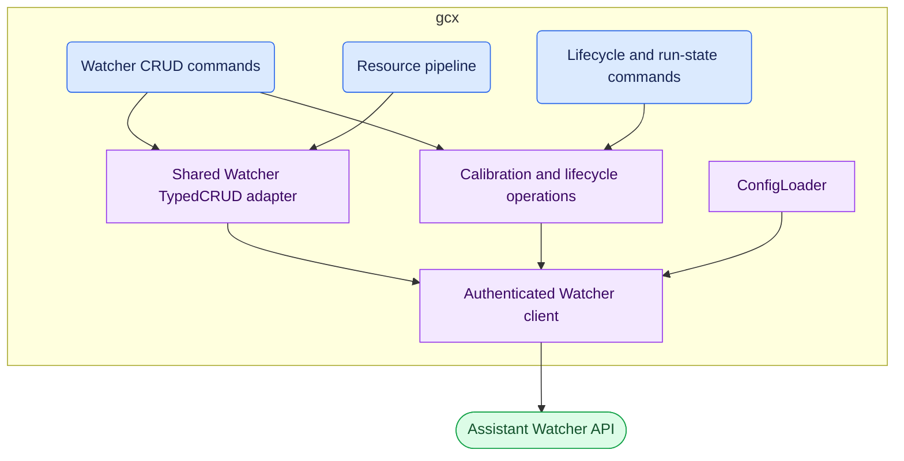
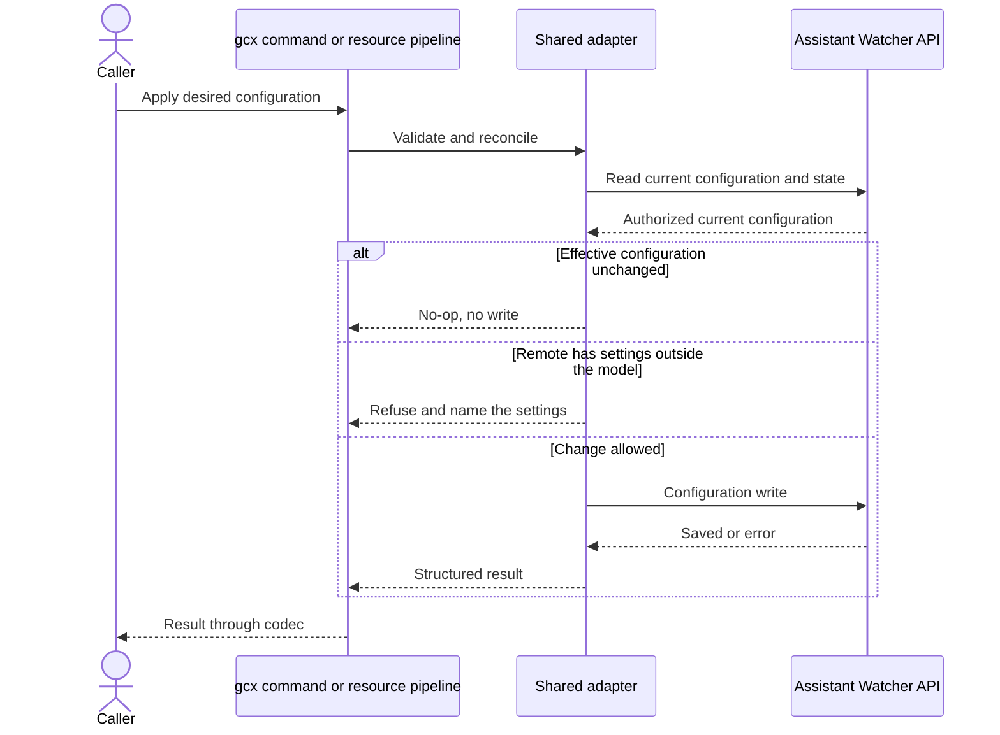
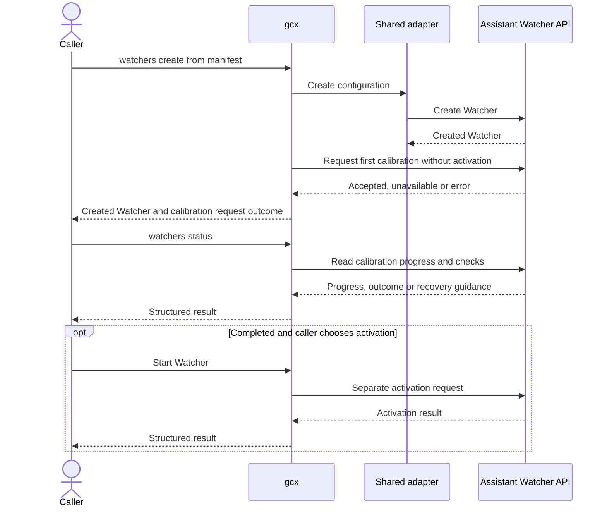

# RFC 002: Manage Assistant Watchers through gcx

## Summary

Extend `gcx assistant` with Watcher management: creation, inspection, updates, calibration, scheduling controls, run history, and deletion. Include declarative definitions through `gcx resources push/pull`, and Assistant-managed calibration requested when `watchers create` creates a Watcher. Configuration includes scheduling, sensitivity, automatic stop, labels, notification destinations and investigation actions. Version inspection and restore are proposed as part of management.

Push reconciles configuration only. It applies to a running Watcher without pausing it, and an unchanged push writes nothing except supplied secret values. Push never calibrates a Watcher; dedicated `create` requests calibration after creating it. Activation is always a separate, explicit operation. Runtime history and learned state are outside the writable definition.

## Motivation

Assistant Watchers periodically assess telemetry, keep monitoring context and report notable findings. gcx has no Watcher commands today, so engineers who work in a terminal or with a coding agent have to leave that workflow to set up and maintain monitoring for the services they change. Teams also want Watcher definitions to be reviewable: kept in version control, inspected before they are applied, and reconciled without unexpectedly starting background work.

An engineer wants recurring checks for a service. They create a Watcher with monitoring intent and relevant configuration, and gcx asks Assistant to calibrate it. Assistant discovers checks in the background. The engineer follows progress, reviews the calibrated checks and explicitly starts monitoring.

Later, they pull the definition, review a proposed change and push it. A running Watcher keeps running with the new configuration, and a repeated unchanged push does nothing. If the change needs recalibration, they recalibrate in Grafana or rely on automatic recalibration when it is enabled. gcx never pauses, restarts or recalibrates a Watcher implicitly.

## Scope

This RFC covers management of Assistant Watcher resources. The design includes both dedicated management commands and generic resource push/pull, initial calibration requested by `create`, explicit activation, pause and run controls, configuration and result inspection, notifications, and archive/unarchive operations, as well as version management.

Other calibration stays in Grafana: calibrating a Watcher created by `resources push`, following up when calibration fails or needs more input, cancelling it, and recalibrating a calibrated Watcher. Automatic recalibration can also update checks. gcx has no calibration commands.

Version history, comparison and explicit restore are proposed in this RFC. Cross-stack portability requires a specific identity and dependency-mapping contract before it can be promised.

Local-agent calibration and local coding handoff are deferred to separate RFC(s).

Watchers and their API are in public preview. The `gcx assistant watchers` command tree is therefore marked experimental under the [experimental command rules](../design/experimental-commands.md) until the product contract stabilizes. The API is expected to change as the feature evolves before general availability, so commands may change between releases while they are experimental.

## User experience

All Watcher commands, the `watchers` resource selector, and payload fields in this section are proposed. Existing generic resource flags such as `--path` and `--dry-run` retain their current meaning. `WATCHER` is the Watcher's resource name (`metadata.name`), described under [Resource model](#resource-model); the server-assigned ID is also accepted to disambiguate. Examples use the selected gcx context; `--context <name>` can select another one.

The CLI must distinguish lifecycle state from health. A paused Watcher may retain an older warning; a failed scan is not a healthy assessment. Likewise, acceptance of a run request is not evidence that the scan completed.

### Create and activate a Watcher

A Watcher manifest holds configuration only. The annotated example below covers every configuration field proposed in this RFC; [Resource model](#resource-model) describes the rules behind it.

```yaml
apiVersion: assistant.ext.grafana.app/v1alpha1
kind: Watcher
metadata:
  name: checkout-health # Derived from spec.title; see Resource model.
  annotations:
    assistant.ext.grafana.app/watcher-id: example-id # Server-assigned ID; same-stack addressing only.
spec:
  title: Checkout health # Required nonempty display title.
  description: Watch the checkout service during a rollout. # Empty clears it.
  prompt: Watch request failures and sustained latency increases. # Required intent.
  datasourceUids: [example-prometheus] # References must be accessible on the target.
  interval: 15m # Positive duration within the target's supported range.
  sensitivity: balanced # sensitive | balanced | relaxed; default balanced.
  skipReviewOnCleanRuns: true # Skip model review for clean scans; default true.
  autoStop:
    enabled: false # Default false.
    at: "2030-01-01T18:00:00Z" # Required when enabled; RFC 3339 with explicit offset.
    archive: false # Archive on automatic stop; default false.
  labels: # Watcher context for notifications, separate from metadata labels.
    service: checkout
    team: example-team
  automaticRecalibration:
    enabled: false # Opt in to Assistant check updates while active; default false.
  notifications:
    slack:
      enabled: false # All delivery actions default to disabled.
      channelId: C_EXAMPLE # Required when enabled; integration must already exist.
      severity: warning-and-critical # warning-and-critical | critical; default former.
    teams:
      enabled: false # Requires a supported, configured integration when enabled.
      channelId: example-channel # Required when enabled.
      severity: warning-and-critical # Same severity choices and default as Slack.
    alerting:
      enabled: false # Routing policies/contact points are separate alerting resources.
    webhook:
      enabled: false
      severity: critical # Same severity choices and default as Slack.
      # Secret input: exactly one of fromEnv, fromFile, preserve: true, clear: true; omitted keeps the stored value.
      url: { fromEnv: WATCHER_WEBHOOK_URL } # Required when enabled; never exported in plain text.
      bearerToken: { fromEnv: WATCHER_WEBHOOK_TOKEN } # Optional credential.
      signingSecret: { fromFile: ./secrets/webhook-signing-key } # Optional credential.
  investigation:
    enabled: false # Investigate critical findings; default false.
    teamAccess: [example-team] # Explicit team grants; [] adds no grants.
```

For a new `watcher.yaml`, use the example's metadata and desired `spec` settings. Omit unused notification destinations and secret inputs; include credentials only for destinations being configured. Assistant will populate finalized checks during calibration.

```bash
# Create the definition; gcx then requests its first Assistant-managed calibration.
# The result reports the resource name used below as WATCHER.
gcx assistant watchers create -f watcher.yaml -o json

# Follow calibration progress; once it completes, review the calibrated checks.
gcx assistant watchers status WATCHER -o yaml

# Start monitoring explicitly.
gcx assistant watchers start WATCHER -o json
```

The creation result identifies the new resource and reports whether calibration was requested. An accepted request means work was queued, not that checks are ready. If gcx cannot request calibration, for example because the stack does not support it, the Watcher is still created and the result says to calibrate it in Grafana; gcx neither deletes the Watcher nor retries. `status` distinguishes calibration in progress from completion, failure, cancellation and a request for more input. When calibration fails or needs more input, the user continues in Grafana and does not proceed to `start`. If the API rejects an edit while calibration is in progress, gcx reports that the user should wait for it to finish or cancel it in Grafana.

Successful calibration stores reviewable checks but does not activate the Watcher. `start` must reject an unready definition, including one without an enabled check. Any immediate scan or notification triggered by activation must be described in the eventual command help.

### Follow calibration and review checks

We propose a `status` command, to show the status of a watcher, its calibration state and checks, as well as audit & version information (those can be paired with version commands for browsing through different versions of a configuration). This command is read-only and does not change the configuration. The following is an illustrative example of the output of this command:

```yaml
# gcx assistant watchers status WATCHER -o yaml (illustrative)
lifecycle: paused # Observed lifecycle, changed only through explicit lifecycle operations.
assessment:
  severity: ok # ok | warning | critical; the last assessment, not proof that monitoring is running.
  observedAt: "2030-01-01T12:00:00Z"
calibration:
  state: completed # Observed progress and readiness, never inferred from configuration.
  message: Calibration completed. # Recovery guidance when calibration fails or needs input.
  context: Compare sustained changes against the established baseline.
  checks:
    - id: example-check # Stable check identity.
      title: Request volume
      enabled: true
      datasourceUid: example-prometheus
      queryType: promql # Public Watcher query type.
      expression: sum(rate(example_requests_total[5m]))
      guidance: Context signal. Volume should stay within its established baseline; interpret changes alongside request failures and latency.
      parameters: {} # Type-specific thresholds, windows and filters; exact schemas remain open.
runs:
  lastStartedAt: "2030-01-01T11:59:00Z"
  lastCompletedAt: "2030-01-01T12:00:00Z"
  nextScheduledAt: null # No scheduled scan while paused; history uses list-runs.
usage:
  estimatedTokensPerRun: 1000 # Server-reported estimate, not a limit or guarantee.
audit:
  createdBy: example-user
  createdAt: "2030-01-01T10:00:00Z"
  updatedAt: "2030-01-01T12:00:00Z"
version:
  id: "2" # Current definition version; history uses list-versions and versions get.
```

Status names and values are illustrative and require external API mapping. Unavailable observations must be omitted or explicitly unknown, never fabricated. Learned notes/issues and full run/version histories remain separate read-only results.

Each calibrated check shows its identity, title, enabled state, data source, query type, expression, interpretation guidance and type-specific parameters. An unrecognized query type or parameter is shown as unsupported rather than discarded.

### Change a definition through files

```bash
gcx resources pull watchers/WATCHER -p ./watchers -o yaml
# Edit the pulled file, validate it, then apply it. A running Watcher keeps running.
gcx resources push -p ./watchers --dry-run
gcx resources push -p ./watchers

# Inspect readiness. If the change needs recalibration, recalibrate in Grafana.
gcx assistant watchers status WATCHER -o json
```

Dedicated commands support the same read/edit/write workflow with the same manifest:

```bash
gcx assistant watchers get WATCHER -o yaml > watcher.yaml
# Edit watcher.yaml, preserving its identity.
gcx assistant watchers update WATCHER -f watcher.yaml -o json
# Inspect readiness; recalibration, if needed, happens in Grafana.
gcx assistant watchers status WATCHER -o json
```

Dry-run reads the manifests and validates them against the Watcher schema, reporting unknown fields, missing required fields, invalid values and malformed secret inputs; it writes nothing. Validation is client-side only, so errors that only the server detects, such as an inaccessible data source or a missing integration, surface on apply. Apply writes only when the effective configuration differs from the current one, so an unchanged apply is a no-op apart from supplied secret values. Writes are last-writer-wins: the manifest is authoritative, so a push overwrites changes made elsewhere, for example in the Grafana UI. Reviewing a change means reviewing the manifest diff, for example in a pull request, together with dry-run validation; a diff preview for the resources pipeline is separate work.

### Request a scan and inspect its outcome

```bash
gcx assistant watchers run WATCHER -o json
gcx assistant watchers list-runs WATCHER --limit 20 -o json
gcx assistant watchers status WATCHER -o json
```

The first result reports request acceptance rather than a completed assessment. Run history identifies actual executions and their outcomes. It must not assume that an enqueue identifier is a completed run identifier or that the newest entry belongs to this request. Exact correlation is an API validation requirement. A failed or still-running scan must not be rendered as healthy; bounded history must carry a continuation or an explicit coverage limit.

### Inspect and restore a version

Versions belong in the management surface: a user needs to see what calibration or a configuration edit changed and recover a prior definition. The proposed view includes version identifier, time, actor, change summary, before/after changes and, when the API reports it, whether the change kept or reset learned run state. Those are read-only evidence; gcx does not compute or expose a model of backend learning internals.

```bash
gcx assistant watchers list-versions WATCHER -o json
gcx assistant watchers versions get WATCHER 2 -o yaml
gcx assistant watchers versions diff WATCHER 1 2 -o json

# Restore replaces the definition: pause and review first.
gcx assistant watchers pause WATCHER -o json
gcx assistant watchers versions restore WATCHER 1 -o json
gcx assistant watchers get WATCHER -o yaml
gcx assistant watchers status WATCHER -o json
# Start separately only when the restored definition is ready.
gcx assistant watchers start WATCHER -o json
```

### Command summary

#### CRUD and declarative configuration

| Proposed invocation                                         | Behavior                                                                                                       |
| ----------------------------------------------------------- | -------------------------------------------------------------------------------------------------------------- |
| `gcx assistant watchers list`                               | Enumerate visible Watcher definitions with honest paging/coverage.                                             |
| `gcx assistant watchers get WATCHER`                        | Read the configuration resource; JSON/YAML match the generic resource path.                                    |
| `gcx assistant watchers create -f watcher.yaml`             | Create an inactive definition, request its first calibration, and return its identity and the request outcome. |
| `gcx assistant watchers update WATCHER -f watcher.yaml`     | Apply configuration through shared CRUD rules, including to a running Watcher.                                 |
| `gcx assistant watchers delete WATCHER --force`             | Delete the selected Watcher using the standard destructive-operation contract.                                 |
| `gcx resources pull watchers/WATCHER -p ./watchers -o yaml` | Write the configuration manifest to disk.                                                                      |
| `gcx resources push -p ./watchers --dry-run`                | Validate manifests against the Watcher schema without writing or starting work.                                |

#### Run state and history

| Proposed invocation                                   | Behavior                                                                                                                            |
| ----------------------------------------------------- | ----------------------------------------------------------------------------------------------------------------------------------- |
| `gcx assistant watchers start WATCHER`                | Activate a successfully calibrated definition with at least one enabled check.                                                      |
| `gcx assistant watchers pause WATCHER`                | Stop future scheduled scans; report the handling of any in-flight scan.                                                             |
| `gcx assistant watchers run WATCHER`                  | Request one scan and report acceptance, rejection or skipped work.                                                                  |
| `gcx assistant watchers status WATCHER`               | Read runtime state: lifecycle, calibration progress and calibrated checks, latest assessment, run times, usage and current version. |
| `gcx assistant watchers list-runs WATCHER --limit 20` | Read a bounded run history, reporting whether more history is available.                                                            |
| `gcx assistant watchers archive WATCHER`              | Archive an explicitly paused Watcher, retaining configuration and history.                                                          |
| `gcx assistant watchers unarchive WATCHER`            | Make an archived Watcher available again without activating it.                                                                     |

#### Versions

| Proposed invocation                                                    | Behavior                                                                                              |
| ---------------------------------------------------------------------- | ----------------------------------------------------------------------------------------------------- |
| `gcx assistant watchers list-versions WATCHER`                         | Enumerate retained definition versions and disclose retention/paging limits.                          |
| `gcx assistant watchers versions get WATCHER VERSION`                  | Read a selected version and its change metadata.                                                      |
| `gcx assistant watchers versions diff WATCHER FROM_VERSION TO_VERSION` | Compare two retained definitions without changing the Watcher.                                        |
| `gcx assistant watchers versions restore WATCHER VERSION`              | Restore the selected definition after explicit pause, subject to concurrency checks; remain inactive. |

`status` is the view of runtime state; the resource itself carries configuration only.

## Technical design

### Components and boundaries

As in the [alerting resource proposal](001-alerting-provider-refactor.md#proposed-client-and-provider-plumbing), dedicated configuration commands and the generic resource pipeline share resource access. Here that access is the existing typed-adapter model extended with a Watcher domain type. The calibration request after `create`, and lifecycle and run-state operations, use the same configured client but remain domain operations outside the shared adapter.

Blue marks entry points, purple marks gcx components, and green marks the external API. Assistant is opaque: these diagrams specify gcx behavior and observable API interactions, not remote persistence, scheduling or worker implementation.



The provider registers the resource descriptor, schema and factory. Command construction loads dependencies lazily through the shared configuration loader. Dedicated commands retain imperative semantics; the resource pipeline retains upsert. The adapter maps manifests to the supported product API and applies the same identity and update policy on both paths. Read results go through the existing codecs.

### Provider and resource integration

Extend the [existing Assistant provider](../../internal/providers/assistant/provider.go) and reuse its configuration loading and [product REST transport](../../internal/assistant/assistanthttp/client.go). Keep command wiring separate from domain behavior. Deterministic resource operations should call product APIs rather than ask a conversational agent to perform CRUD.

Register a typed resource adapter in the existing provider. Both provider CRUD commands and the generic resource pipeline must use the same `TypedCRUD` implementation, following the [constitution](../../CONSTITUTION.md). Resource identity, schema and examples must satisfy the existing adapter contract.

The writable definition contains user-managed configuration. Lifecycle state, run history and learned state are excluded. Preserve identity for same-stack updates without treating generated runtime fields as writable configuration. The manifest uses the proposed Watcher kind and the Assistant API group/version shown above. Stable query identity and cross-stack creation semantics still require validation before implementation.

Both access paths must enforce the same lifecycle and update rules. JSON/YAML representations must remain consistent across them; domain-specific human views may differ through the codec system.

### Resource model

The proposed manifest uses `assistant.ext.grafana.app/v1alpha1`, following the [existing MCP server resource metadata](../../internal/assistant/mcpserver/mcpserver.go). The annotated example under [Create and activate a Watcher](#create-and-activate-a-watcher) covers every configuration field proposed in this RFC. The adapter defines explicit field mapping between GCX schema and the underlying API and rejects unknown fields, i.e. if the remote Watcher has settings outside this model, gcx refuses the writes, to prevent accidental loss of configuration.

Identity follows the [MCP server resource](../adrs/assistant-provider/001-assistant-provider-and-mcp-servers-as-resources.md). Titles are not guaranteed to be unique, and each Watcher has a server-assigned ID. `metadata.name` is derived from `spec.title`. The server-assigned ID is carried in the `assistant.ext.grafana.app/watcher-id` annotation and addresses the Watcher within its stack only. A push whose manifest has no matching ID matches on the natural key `spec.title`, so repeating a push to another stack updates the Watcher it created rather than creating a duplicate. When several Watchers share a title, gcx never picks one: `get`, `update` and `delete` by name, `resources pull`, and a natural-key match on push report the candidates with their server-assigned IDs and act on none of them. Pull still writes the other Watchers. Addressing a Watcher by its server-assigned ID, or renaming one of them, resolves the conflict. Renaming a Watcher changes its natural key, so pushing a renamed manifest to another stack creates a new Watcher there.

Writes replace the configuration that the manifest models. An omitted optional field or block takes its documented default on both create and update, so a manifest produces the same configuration whether or not the Watcher already exists. For example, removing the `notifications.slack` block disables Slack delivery. Collection fields (`labels`, `datasourceUids` and `investigation.teamAccess`) are replaced as a whole; empty values clear them where allowed. Write-only secrets are the exception: an omitted secret keeps its stored value. A full pull materializes every supported setting, so a subsequent push is stable. The adapter translates these semantics where the product API's omission rules differ.

Each secret input has exactly one operation: `fromEnv` or `fromFile` supplies a value, `preserve: true` keeps the stored value, and `clear: true` removes it. Omitting a secret also keeps its stored value. Pull emits a preserve marker for each configured secret, never a value or preview. On an existing Watcher a preserve marker behaves like omission; on a new target it fails, so a copied manifest cannot silently lose a credential. As with [MCP server headers](../../internal/assistant/mcpserver/mcpserver.go), a supplied value is resolved and written on every push: gcx does not compare secrets, so rotating one means changing its source and pushing again. The no-op guarantee therefore covers everything except supplied secret values, and writing a secret must not change the definition or reset learned state. Whenever gcx writes the webhook URL, each existing bearer token and signing secret must be supplied or cleared in the same request, so credentials cannot carry over to a different endpoint. URL clearing is rejected while the webhook remains enabled. Resolved values exist only for the request and never appear in output. Unlike MCP headers, omission keeps a stored secret instead of removing it, and clearing is explicit.

Push configures notification destinations but does not send a test notification or start a scan. Enabling or using an unavailable capability, or one with missing integration prerequisites, produces an explicit error. Explicitly disabling an integration remains valid without its setup prerequisites; for example, `teams.enabled: false` does not require Teams setup. Destination testing, if exposed later, must be an explicit operation because it sends a real message.

Runtime state is read-only: current assessment, active/archive state, run timestamps, token estimates, creator/audit metadata, learned notes/issues, version metadata and learned-state indicators do not belong in `spec`. Archive and activation use lifecycle commands. Version history is not embedded in the manifest.

Automatic recalibration is disabled by default. Setting `automaticRecalibration.enabled: true` lets Assistant update checks while monitoring continues. Saving the opt-in does not itself run discovery or start monitoring. Because checks are not part of the manifest, these updates never conflict with pushed configuration; `status` and version history show what changed.

### Configuration apply and reconciliation

Dedicated `create` creates a resource and `update` targets an existing resource; generic `push` remains an upsert. Both paths use the same configuration rules. Dedicated `create` follows the shared create with a calibration request. A Watcher created by `push` stays uncalibrated until someone calibrates it in Grafana, so a push never starts paid background work. Neither path pauses or starts a Watcher.

A no-op is evaluated against the configuration read for this request; it does not promise that other callers cannot change it later.



Creation has the same configuration-only boundary in the shared adapter; the natural-key rules above keep a repeated push from creating duplicates. Neither branch starts scanning. Only dedicated `create` follows up with a calibration request, outside the adapter.

Push saves configuration without running discovery or starting monitoring. A new Watcher remains inactive. Repeated unchanged pushes must not create duplicates, rerun calibration, change query identities or reset learned state.

Configuration changes through dedicated update commands and generic push apply to a running Watcher without pausing it. Version restore is the exception and requires an explicit pause, as described under [Versions and restore](#versions-and-restore). A rejected update leaves configuration and scheduling unchanged. No-op detection must compare effective configuration, after normalizing any values the API normalizes, rather than response timestamps or runtime fields.

Writes are last-writer-wins, consistent with push treating local files as authoritative. gcx does not detect concurrent edits, and the public API documents no write precondition. Assistant's automatic check updates cannot conflict with a push because checks are not part of the manifest. Establish how a scan already in progress is handled when its configuration changes.

### Create and calibration flow



The calibration request never starts monitoring; gcx asks for calibration without automatic activation. Opted-in automatic check updates may operate while monitoring remains active. Cancellation and missing-input recovery happen in Grafana. The Assistant API remains opaque to gcx.

Assistant-managed calibration produces checks that can be inspected before activation. gcx requests it once, after `create`, and reports progress, completion, failure, cancellation and requests for more input through `status`. Local-agent check submission and finalization are outside this RFC.

Requesting calibration is not completion. The CLI must not claim success merely because a request was accepted or a lifecycle field changed. gcx offers no conversational resume; recovery happens in Grafana.

Calibration never starts monitoring. Activation requires a separate explicit start; neither push nor `create` requests automatic activation. The eventual command contract must describe any immediate scan or notification effects of start and run operations.

### Versions and restore

Restore is a dedicated version operation, not a push of an old response containing runtime state. Unlike other configuration changes, restore requires an explicit pause because it replaces the definition as a whole; the product likewise pauses a Watcher before restoring it, while gcx never pauses implicitly. It creates a new current version from the selected definition, retains current notification/investigation actions, does not copy learned run state, and leaves monitoring inactive. It must reject a stale current-version guard or a conflicting calibration. The API's exact restore scope must be reported; it must not be advertised as restoring every setting in the current manifest. Compare retained definitions only and disclose unavailable/pruned history; do not invent missing earlier versions. Archive recovery is separately named `unarchive` to avoid confusing it with definition restore.

### Secrets, permissions and completeness

A pulled definition must not contain credentials or redacted placeholders that would be written back as credentials. Secret inputs follow the rules under [Resource model](#resource-model). A new target without required credentials must receive an actionable error rather than appear fully configured.

Reuse existing context authentication. A Watcher runs with the identity that created it, so gcx creates Watchers as the context's configured identity: a user through OAuth or a service account through its token. That identity determines which data sources the Watcher can query and which creator-linked integrations, such as Slack, are available to it. Verify each supported identity and its permissions for reads, definition writes, calibration and execution. Do not infer API support from an ambiguous 404 or silently switch identities. Missing capability, denied access, absent objects and empty collections are distinct outcomes.

Read commands must expose pagination and coverage honestly. Bounded history must not appear complete, and an out-of-range result must not be called nonexistent. Fetch equivalent data across output formats and apply display choices through codecs. Follow existing [output](../design/output.md), [agent-mode](../design/agent-mode.md), and [safety](../design/safety.md) contracts.

## Drawbacks

- **Push overwrites edits made elsewhere.** Writes are last-writer-wins, so an edit made in Grafana disappears at the next push of an older manifest. Teams that manage a Watcher from git should treat git as its only editor.
- **Push always writes supplied secrets.** gcx cannot compare write-only secrets, so a manifest that supplies them is never a complete no-op.
- **Some Watchers need Grafana before they can run.** Push never calibrates and gcx has no calibration commands, so a Watcher created by push, or one whose calibration fails or needs more input, has to be finished in Grafana.
- **Identity depends on titles.** Renaming a Watcher creates a new one on other stacks, and a title shared by several Watchers blocks pulling and writing those Watchers until the user renames one or addresses it by ID.
- **gcx cannot write every Watcher.** A Watcher with settings outside the gcx model stays read-only to gcx until the model covers them.
- **Dry-run checks only the schema.** Errors that only the server detects surface on apply.
- **Restore interrupts monitoring.** The Watcher must be paused before a restore and started again afterwards.
- **The creating identity carries over to runs.** A Watcher created with a service-account token runs as that account and cannot use creator-linked integrations such as Slack.
- **The API is a public preview.** Calibration, version and archive contracts are still open, and the experimental command tree may change without the usual compatibility promise.

## Rationale and alternatives

**Extend the Assistant provider.** It already owns the command home, configuration loading and REST transport. A separate Watchers provider would duplicate that ownership.

**Share one typed adapter between dedicated commands and push.** Users can choose imperative commands or declarative files without meeting different identities or manifest formats. Dedicated commands alone would be simpler to build, but would leave Watchers out of version-controlled workflows.

**Apply changes to running Watchers.** Configuration-only push keeps repeated applies predictable, and applying them to a running Watcher matches the product and avoids a monitoring gap. Requiring a pause before every write would give a visible update boundary, but declarative automation would then have to pause, push and restart a Watcher that is normally running. Restore keeps an explicit pause because it replaces the definition as a whole.

**Replace with defaults instead of merging.** A manifest produces the same configuration whether or not the Watcher exists, and removing a block from git disables it. Merging omitted fields would protect settings a hand-written manifest forgot, but the same file would then give different results on new and existing Watchers, and push would no longer treat local files as authoritative. Write-only secrets are the exception because gcx cannot read them back.

**Last writer wins, without conflict detection.** A revision guard carried in manifests would catch concurrent edits. But every change made in Grafana or by automatic recalibration would leave the manifests in git stale, and the public API documents no write precondition to build the guard on.

**Calibrate from `create`, not from push, with no calibration commands.** `create` takes a Watcher from definition to calibration in one step. Calibrating on push as well would start paid background work whenever a manifest reaches a new stack. Dedicated calibration commands would add little for now, because recovery, retries and recalibration go through the interactive calibration flow in Grafana.

**Keep calibrated checks read-only.** Assistant stays their only writer, so automatic recalibration cannot conflict with git. Writable checks would make manifests portable across stacks, but accepting checks that Assistant did not discover needs a validate-and-accept step, which belongs with local-agent calibration.

**Match identity on the title.** Server-assigned IDs are not portable, so a push to another stack needs a natural key, and the title is the only user-controlled candidate. An ambiguous title stops the pull or write instead of guessing, as it does for MCP servers.

**Re-send supplied secrets on every push.** Comparing secrets by reference would need a record of the reference behind each stored value, and the API keeps only the value. Re-sending makes rotation a matter of changing the source and pushing again.

**Include versions and restore.** Version comparison makes configuration and calibration changes reviewable, and restore gives a way back. Both add operations whose API contracts are still open.

## Prior art

**MCP server resource.** [ADR-021](../adrs/assistant-provider/001-assistant-provider-and-mcp-servers-as-resources.md) settled identity for Assistant resources whose names are not unique: a computed `metadata.name`, the server ID in an annotation, a natural key for pushes to other stacks, and an error that lists candidates on collision. It also introduced `fromEnv`/`fromFile` secret inputs that are resolved on every push. Watchers reuse both. Two rules differ. An omitted MCP header is removed, while an omitted Watcher secret keeps its stored value, as the Watcher API does for omitted secure fields. And MCP `update` merges partial input into the current server, while a Watcher write replaces omitted fields with their defaults on both paths.

**Alerting and dashboards.** [RFC 001](001-alerting-provider-refactor.md) and the dashboards provider give dedicated commands and `gcx resources` one shared resource-access path. Watchers follow the same split: configuration goes through the shared adapter, and domain operations such as the calibration request, lifecycle, runs and versions sit beside it.

**Kubernetes-style declarative apply.** gcx push treats local manifests as authoritative and keeps server-observed state out of them, following the Kubernetes split between `spec` and `status`. The Watcher manifest is spec-only for the same reason, and runtime state comes from `watchers status`.

**Terraform write-only arguments.** Terraform handles secrets it cannot read back by pairing a write-only argument with a version argument; changing the version triggers a rewrite. That would let gcx skip unchanged secrets, but it needs state that gcx does not keep, so this RFC follows the MCP model.

**The Assistant product.** Several rules follow the product's own behavior: it pauses a Watcher before restoring a version, runs Watchers as their creator, and keeps omitted secure fields on update. gcx keeps these semantics but makes the pause an explicit step.

## Unresolved questions

- Finalize the illustrative command names, flags, and manifest-to-API mappings. Define scan request correlation before treating examples as a stable CLI contract.
- Which supported API contract provides the calibration request that `create` sends, and how does `status` read its progress and outcome?
- How is a scan in progress handled when its configuration changes?
- What dependency-mapping rules apply to data source UIDs, notification channels and teams when applying to another stack?
- Which external API operations implement the proposed version and archive workflows, and what are their retention and conflict guarantees?
- What authentication modes, limits and pagination behavior are supported for each operation, and how is capability availability established?

Each technical question requires API contract evidence and corresponding tests. The full scope, Assistant-managed calibration requested by `create` (not by push, and without calibration commands), declarative push/pull, configuration-only apply without pausing a running Watcher, a configuration-only resource with read-only calibrated checks, replace-with-defaults and last-writer-wins writes, title-based natural-key identity, and opt-in to Assistant-managed automatic check updates are settled design choices.

## Future possibilities

- Local-agent calibration, in a separate RFC: a local agent discovers and validates checks and hands them back. With code access, memory and user guidance, it may calibrate better than Assistant-managed calibration; comparing both on the same Watcher would show whether it should become the default. The same validate-and-accept step would let manifests carry checks across stacks.
- Calibration commands (request, cancel, retry and recalibrate) once the API supports them without the interactive flow in Grafana.
- Handing Watcher findings to a local coding agent, in a separate RFC.
- Server-side dry-run validation for Watchers, once the API offers a validation operation.
- A diff preview for `gcx resources push`, useful for every resource type.

## Terminology

- **Watcher** is a recurring telemetry assessment definition and its runtime state.
- **Calibration** converts monitoring intent into validated checks and baseline context.
- **Run** is one execution; its lifecycle status differs from its health assessment.
- **Definition version** identifies the configuration used for a run rather than assuming that the current configuration is unchanged.
